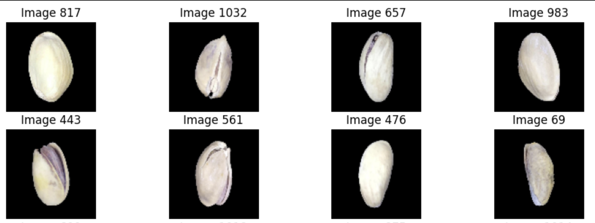
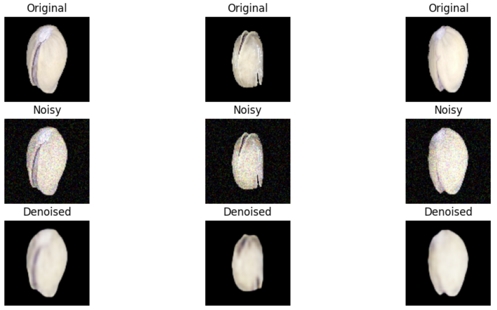

# Image Denoising with Autoencoders 

## Summary
Project denoising to trains model to reconstruct the original clean image and adding artifical noise then taught the model to fix it, then the model given input and showed it the original clean image as the answer. Its often use for real world implementation such as car plate capture camera (moving).

## Problem
1. Image noise reduces data quality and model accuracy
2. Create an automated tool can clean and denoise images to restore the original, high quality version

## Methodology
1. EDA
2. Preprocessing
3. Adding Gaussian Noise
4. Create Base and Modified Model
5. Evaluate

## Skills
1. Python: Scikit-learn, Numpy, Matplotlib, OpenCV, os, and ZipFile
2. Deep Learning Frameworks: Tensorflow and Keras
3. Evaluation: SSIM

## Results

1. Final modified autoencoder achieved high SSIM score of 0.9574 on the test set
2. Visualization shows the image successfullly taking a noisy, corrupted image and producing a denoised version  
3. Modification at activation function and learning rate giving impact to model
   
## Next Steps
1. Trying more advanced architecture like U-Net
2. Hyperparameter tuning to experiment different noise factors
3. Real-world testing
